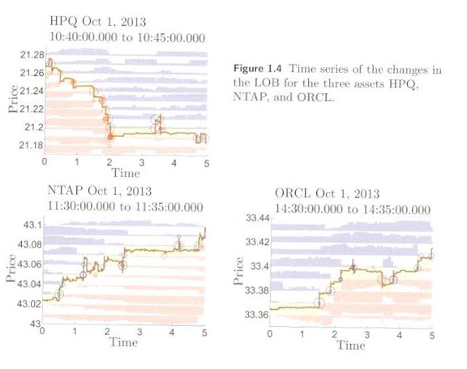

```{r setup, include=FALSE}
# setup block that doesn't show up in the output
knitr::opts_chunk$set(echo = FALSE)
#knitr::opts_chunk$set(cache = TRUE)
require(obmodeling)
require(quantstrat)
require(knitr)
require(pander)
panderOptions("digits", 2)
Sys.setenv(TZ='GMT')
```

## Introduction

obmodeling is an **R** package which uses *xts* time series objects to manipulate and 
analyze:

- Market depth statistics

- Price movement, liquidity changes [@Cartea2015]

- Market spread [@DeJong2009, pp. 91–96]

- Measures of volatility [@DeJong2009 p. 92, and @Cartea2015]

- PIN/VPIN [@Easley1996, @Easley2012a]

## Introduction

- Price pressure [@Hendershott2014, @Cont2014]

- Trade imbalance [@Cont2014]

## Setup

```{r testdata, echo=TRUE}

# load the data here, ob_trades & ob_quotes

load.quotes(system.file('extdata/ob_quotes.csv',package = 'obmodeling'))
load.trades(system.file('extdata/ob_trades.csv',package = 'obmodeling'))


```

- *obmodeling* uses an environment to store parsed trades and quotes
- you can access that environment via `getOB()`
- currently supports Reuters data format, more to come

## Calling Functions

```{r, echo=TRUE}

head(effective.spread('ESH6', store=TRUE),2)

```

- When applicable functions contain a store function, saving the data in the environment

```{r, echo=TRUE}

ob <- getOB()
names(ob$ESH6)

```

## Current Functions

- bidask.changes
- effective.spread
- load.quotes
- load.trades
- market.depth.stats
- quoted.spread
- ticks.wide
- trade.imbalance
- trade.size.stats
- vpin
- wmp

## Visualize Order Book

```{r, echo=TRUE, message=FALSE}

chart.depth('ESH6')

```

## Future Visalizations

{width=50%}

## Future Analysis

- Market Toxicity Measures

- Event Analysis [@Almgren2012]

## Thanks

**Thank You for Your Attention**

find it on github at:  https://github.com/jmazar/obmodeling

install via:

`install_github('jmazar/obmodeling')`

Patches and contributions welcome!

## References {.smaller}
